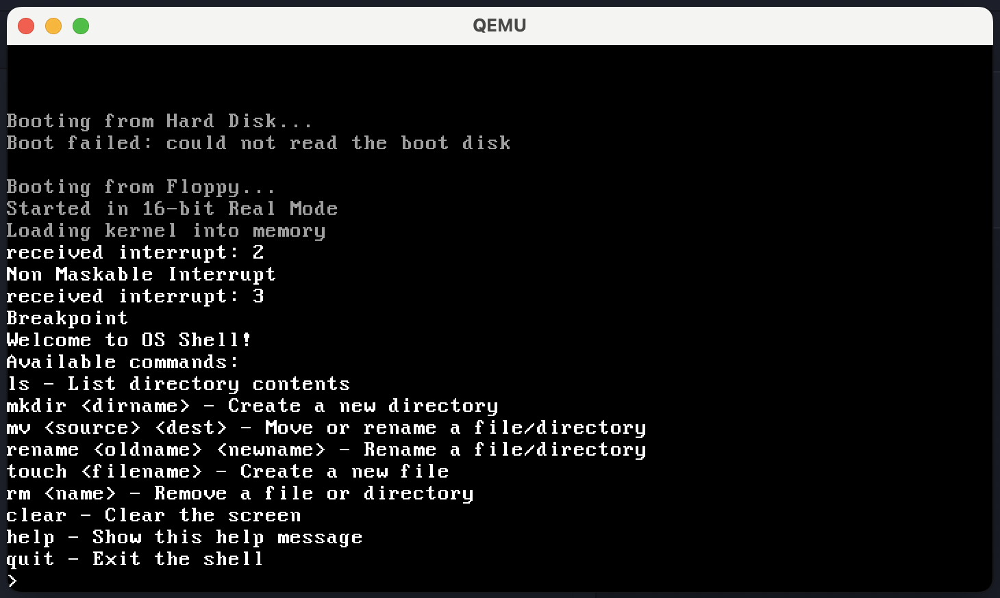

# Custom Operating System

This project demonstrates basic operating system concepts, including a simple shell and a minimal kernel.  
It was inspired by [cfenollosa/os-tutorial](https://github.com/cfenollosa/os-tutorial/tree/master).

## How to Run

### 1. Clone the repository:
   ```bash
   git clone https://github.com/yykido/os_project.git
   cd os_project
   ```
### 2. unzip i386elfgcc.zip
 ```bash
 unzip i386elfgcc.zip -d .
 ```

### 3. Build the OS:
  ```bash
  make run
  ```

## Shell Command
  ```bash
  ls – List directory contents

  mkdir <dirname> – Create a new directory
  
  rename <oldname> <newname> – Rename a file/directory
  
  touch <filename> – Create a new file
  
  rm <name> – Remove a file
  
  clear – Clear the screen
  
  help – Show help message
  
  quit – Exit the shell
  ```


## Project Structure

- `boot/` - Bootloader and kernel entry code
- `kernel/` - Kernel source code
- `drivers/` - Device drivers
- `cpu/` - CPU-specific code
- `libc/` - Basic C library implementation

## Makefile Targets

- `make` - Build the OS
- `make run` - Run the OS in QEMU
- `make debug` - Run the OS in QEMU with GDB debugging
- `make clean` - Clean build artifacts

## Troubleshooting

If you encounter the error i386-elf-gcc: No such file or directory, ensure that you have extracted the i386elfgcc.zip file and installed the toolchain properly as described above.

## License

No Lincese
